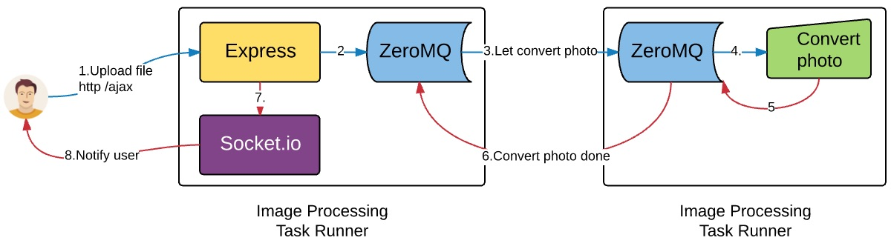

Demo Arrowjs runs long run tasks in other service using ZeroMQ to communicate
==============================
- User uploads image to FrontendServer using AJAX call. SocketID is stored when FrontendServer parse submit form. See `FrontendServer/features/upload-file/view/index.twig`
- FrontendServer sends message with image URL to ConvertService using ZeroMQ. FrontendServer uses module [arrow-zeromq](https://www.npmjs.com/package/arrow-zeromq). See `FrontendServer/features/upload-file/controller/index.js`

```
application.services.convertImage.send({
    action: "image.convert",
    data: {
        link: fileName //Send URL of photo in message payload
    }
}, function (err, data) {  //Convert photo service call back
    if (err) {
        application.io.to(socketId).emit("convertError", err)
    } else {
        application.io.to(socketId).emit("converted", data)
    }
})
```

- ConvertService receives message, converts then sends back new image link through ZeroMQ. See `ConvertService/imageConvert/actions/index.js`
- Frontendserver receives message and notifies to user through socket.io. Stored SocketID stored in previous step is used to send to correct user.


#### Requirement
- imagemagick

```
	brew install imagemagick
```
- Zeromq

```
	brew install pkg-config
	brew install zmq
```
#### Install


install node_modules

```
	npm install

```

Start image converter service first

```
	cd ConvertService
	node server.js
```

Then start frontend server

```
	cd FrontendServer
	node server.js
```

open browser with link **http://localhost:3333/**